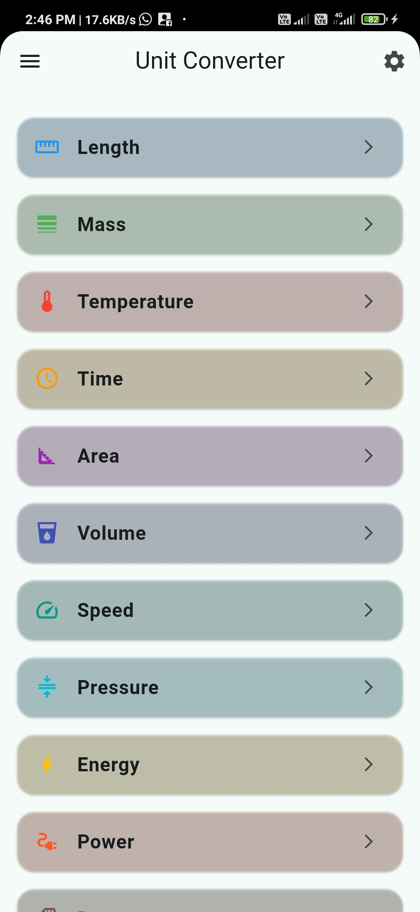
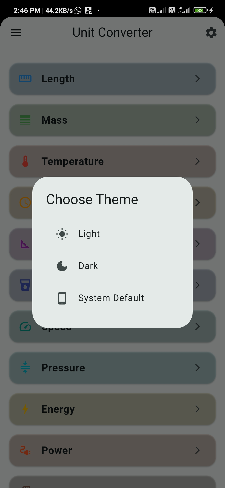

# 🧮 Unit Converter App

A powerful, elegant, and fully offline Flutter application that helps users convert between various units — from Length, Mass, and Temperature to Digital Image and Fuel Economy — all in one place.

---

## ✨ Features

- 🔄 Converts across 15+ unit categories
- 🌗 Theme selector (Light / Dark / System default)
- 📱 Clean and intuitive UI
- 💾 Fully offline support
- 🎯 Accurate conversion formulas
- 🔒 No ads, no tracking
- 🧭 Drawer navigation for quick access

---

## 📸 App Screenshots

 
> 

---

## 🚀 Installation & Run Locally

Make sure you have Flutter installed. Then:

```bash
git clone https://github.com/your-username/unit-converter.git
cd unit-converter
flutter pub get
flutter run
```

---

## 📦 Build APK

To build a release APK:

```bash
flutter build apk --release
```

You can rename it:

```bash
mv build/app/outputs/flutter-apk/app-release.apk UnitConverter.apk
```

Copy `UnitConverter.apk` to your device and install it manually.

---

## 🛠 Tech Stack

- ✅ Flutter (Material 3)
- ✅ Dart
- ✅ Offline-first architecture
- ✅ Responsive layout

---

## 🤝 Contributing

Contributions are welcome!

- Fork the repo
- Create a feature branch
- Commit your changes
- Submit a pull request

Or [open an issue](https://github.com/your-username/unit-converter/issues) for bugs or suggestions.

---

## 📄 License

This project is licensed under the **MIT License**.  
See the [LICENSE](LICENSE) file for full text.

---

## 📬 Contact

- 📧 **Email:** themyuiningshen2000themyui@gmail.com.com  
- 💼 **LinkedIn:** https://www.linkedin.com/in/themyui-ningshen-1021b6268/
- 🐙 **GitHub:** https://github.com/Themyui

---

## 🌐 Social Media

[](https://facebook.com/your-page)
[](https://instagram.com/your-handle)

---

## 📁 Project Structure

```
lib/
├── main.dart
├── models/
│   └── unit.dart
├── screens/
│   ├── home_screen.dart
│   ├── converter_screen.dart
│   └── about_screen.dart
└── widgets/
    └── custom_drawer.dart
```

---

_Thanks for using Unit Converter App!_
